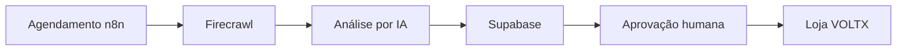

# VOLTX / APEX Supplier Finder

Infraestrutura inicial do n8n para pesquisar produtos em distribuidores aprovados, analisar evidências com IA, calcular margem e registrar recomendações no Supabase.

O fluxo **não publica nem compra produtos automaticamente**. Toda recomendação nasce com `human_status = pending` e precisa de aprovação humana.

## Arquitetura



## O que já está incluído

- n8n `2.35.7` fixado em Docker
- PostgreSQL separado para os dados internos do n8n
- Busca diária às 07:00, horário de São Paulo
- Lista inicial limitada a Hayamax, Oderço, Martins e SND
- Firecrawl Search v2
- Compatibilidade com APIs de IA no padrão OpenAI
- Score de 0 a 100 e níveis de risco
- Cálculo de margem bruta quando custo e preço estão disponíveis
- Upsert atômico no Supabase por `source_url`
- Portão obrigatório de aprovação humana
- Notificação opcional pelo Telegram
- RLS e permissões administrativas no Supabase
- Validação automática no GitHub Actions

## 1. Pré-requisitos

- Docker Desktop ou Docker Engine com Compose
- Uma conta Firecrawl
- Uma API de IA compatível com `/chat/completions`
- Um projeto Supabase
- Telegram opcional

Para produção, use um VPS ou serviço gerenciado. O Compose local vincula o n8n somente a `127.0.0.1`, evitando exposição direta na internet.

## 2. Configurar variáveis

Copie `.env.example` para `.env` e preencha os valores.

Gere senhas e uma `N8N_ENCRYPTION_KEY` fortes. Nunca envie `.env` ao GitHub. Qualquer chave anteriormente compartilhada em conversa deve ser revogada e substituída antes do uso.

Variáveis obrigatórias:

- `FIRECRAWL_API_KEY`
- `AI_BASE_URL`
- `AI_API_KEY`
- `AI_MODEL`
- `SUPABASE_URL`
- `SUPABASE_SERVICE_ROLE_KEY`
- `N8N_ENCRYPTION_KEY`
- `N8N_DB_PASSWORD`

A chave `SUPABASE_SERVICE_ROLE_KEY` é exclusiva do servidor e nunca deve entrar no Lovable ou em qualquer JavaScript enviado ao navegador.

## 3. Preparar o Supabase

Abra o SQL Editor do projeto Supabase e execute:

```text
supabase/schema.sql
```

O script cria:

- `suppliers`
- `supplier_products`
- `apex_recommendations`
- `ai_runs`
- `audit_logs`

As tabelas ficam sem acesso anônimo. Usuários autenticados somente conseguem acessá-las quando `app_metadata.role = admin`.

## 4. Iniciar o n8n

```bash
docker compose up -d
```

Abra `http://localhost:5678`, crie a conta proprietária e conclua a configuração inicial.

## 5. Importar o workflow

Na interface do n8n:

1. Abra **Workflows**.
2. Escolha **Import from File**.
3. Selecione `workflows/voltx-supplier-finder.json`.
4. Execute manualmente uma vez.
5. Revise os resultados no Supabase.
6. Ative o workflow somente depois do teste.

O workflow também está montado dentro do contêiner em `/files/workflows`.

## Funcionamento do fluxo

1. O acionamento manual ou diário inicia oito buscas controladas.
2. A cada dia, as categorias são distribuídas entre os domínios aprovados.
3. O Firecrawl retorna páginas e evidências públicas.
4. A IA deve usar apenas as evidências recebidas e retornar `null` quando não souber.
5. O código normaliza números, calcula margem e aplica regras de risco.
6. O Supabase salva ou atualiza a recomendação.
7. Itens `recommend` ou `review` podem gerar um alerta no Telegram.
8. Nenhum item é publicado até um administrador alterar `human_status` para `approved`.

## Regras atuais de decisão

- `BLOCK`: fonte explicitamente bloqueada ou risco bloqueado
- `REJECT`: risco alto
- `RECOMMEND`: fornecedor verificado, dados mínimos presentes, margem bruta mínima de 35% e score mínimo de 70
- `REVIEW`: qualquer outro caso

Essas decisões são triagem técnica, não substituem verificação de CNPJ, contrato, nota fiscal, garantia, logística e compra de amostra.

## Segurança e produção

- Não exponha a porta `5678` diretamente no roteador.
- Para acesso externo, use VPS, domínio, HTTPS e proxy reverso.
- Restrinja quem pode editar workflows, pois editores podem executar integrações.
- Este Compose define `N8N_BLOCK_ENV_ACCESS_IN_NODE=false` porque o fluxo lê segredos do servidor com `$env`. Use uma única conta administrativa confiável; em uma equipe, migre as chaves para credenciais nativas do n8n antes de liberar acesso de editor.
- Mantenha o n8n e o PostgreSQL atualizados após testar novas versões.
- Faça backup dos volumes `n8n_data` e `postgres_data`.
- Prefira APIs oficiais. Respeite termos de uso, robots.txt e limites dos fornecedores.
- Revise manualmente produtos com bateria, garantia complexa ou dados incompletos.

## Próximas fases

1. Conectar a API de catálogo do fornecedor aprovado.
2. Criar o painel de revisão no Lovable.
3. Integrar Mercado Pago por função segura no servidor.
4. Adicionar cálculo real de frete e impostos.
5. Publicar produtos aprovados na VOLTX.
